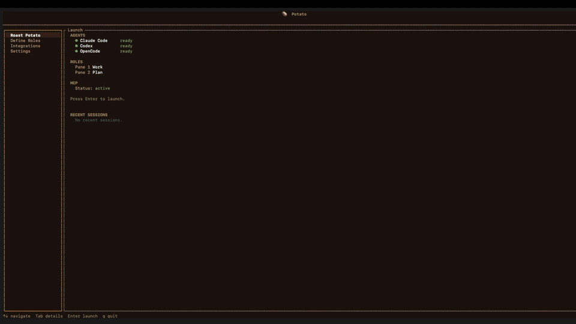

# 🥔 POTATO

**Personal Orchestration Tool for Agentic Task Operations**

*A terminal cockpit for coding agents.*

Potato runs real agents like Claude Code and Codex in embedded terminal panes, gives them shared coordination tools over MCP, and lets you watch the work happen in one place.

> Potato does **not** replace your agents. It gives them a shared workspace, project context, and a mission control you can actually use.



## Why Potato?

Coding agents are already good in isolation. The problem starts the moment you want them to work **together**.

Without Potato, multi-agent work usually means:
- too many terminals,
- too much copy-pasted context,
- no shared task state,
- no clean way to see who is doing what,
- and far too much of *you* acting as the router.

Potato turns that mess into a single project cockpit:
- launch agents side by side,
- assign roles,
- let them coordinate through MCP,
- keep project context and task visibility in one place,
- and stay in the loop without micromanaging every turn.

[](https://www.rust-lang.org/)
[](#development)
[](LICENSE)

---

## What Potato Is

If Claude Code is excellent in one terminal, Potato is what happens when you want:

- an **architect** and an **implementer** side by side,
- a shared **task board** instead of copy-pasting context,
- project-aware **roles**, **messages**, and **shared context**,
- and a TUI that shows what your agents are actually doing.

Potato is built in Rust with [ratatui](https://github.com/ratatui/ratatui). It embeds real PTY sessions, tails native agent logs for observability, and wires sessions together through a built-in MCP server.

## What It Does Today

### Real embedded agent terminals
- Launch Claude Code, Codex, or a generic CLI agent in actual PTYs
- Keep the native agent feel instead of simulating turns in a fake chat UI
- Support side-by-side panes for concurrent work
- Preserve terminal-local scrollback inside each pane

### Coordination via MCP
- Potato exposes MCP tools to running agents
- Agents can message each other, claim/release tasks, inspect partner status, and read/write shared context
- Coordination is project-local and routed through Potato instead of brittle prompt hacks

### A cockpit instead of a pile of terminals
- **Dashboard-first launch flow**
- **Role definition** before starting a run
- **Team / Tasks / Context** right rail during a session
- **Git panel** on the left for project awareness
- **Settings** and **Integrations** panels in-app

### Truth-first observability
- Claude and Codex remain the source of truth for their own session identity and usage
- Potato reads native logs instead of inventing synthetic state
- Metrics, tool activity, and session context stay tied to what the agent actually did

### Project-aware workflow
- Reads OpenSpec task data from `openspec/changes/*/tasks.md` (markdown checkboxes) via the official [OpenSpec CLI](https://github.com/openspec-ai/openspec)
- Falls back gracefully when OpenSpec is absent
- Stores project-local coordination state under `.potato/`

---

## Quick Start

### Requirements
- Rust 1.94+
- At least one installed agent CLI:
  - [Claude Code](https://docs.anthropic.com/en/docs/claude-code)
  - [Codex](https://github.com/openai/codex)
  - or another terminal agent via the generic adapter

### Build

```bash
git clone https://github.com/fraction12/potato-v3.git
cd potato-v3
cargo build --release
```

### Run

Launch Potato from the project you want your agents to work on:

```bash
cd ~/your-project
/path/to/potato-v3/target/release/potato
```

Or install it somewhere on your `PATH`:

```bash
cp target/release/potato ~/.local/bin/potato
cd ~/your-project
potato
```

---

## How It Works

```text
┌──────────────────────────────────────────────────────┐
│                      Potato                          │
│                                                      │
│  ┌──────────────┐              ┌──────────────┐      │
│  │ Claude Code  │◄── MCP ────► │    Codex     │      │
│  │ Architect    │   tools      │ Implementer  │      │
│  └──────┬───────┘              └──────┬───────┘      │
│         │                             │              │
│         └──────────┐     ┌────────────┘              │
│                    ▼     ▼                           │
│               shared state                           │
│          roles · tasks · messages · context          │
│                                                      │
└──────────────────────────────────────────────────────┘
```

Potato launches the agents, manages the panes, hosts the MCP bridge, and keeps the shared coordination state for the current project.

## Built-in Coordination Tools

| Tool | Purpose |
|------|---------|
| `potato_send_message` | Send a message to another running agent |
| `potato_get_messages` | Read queued messages |
| `potato_get_partner_status` | Inspect what another agent is doing |
| `potato_claim_task` | Claim a task |
| `potato_release_task` | Release a task |
| `potato_shared_context` | Read/write shared project context |
| `potato_get_role` | See current role assignments |
| `potato_list_tasks` | Read actionable tasks from OpenSpec when available |

---

## The UI

```text
┌──────────────┬───────────────────────────────┬──────────────┐
│ Git / nav    │ real embedded terminal pane   │ Team         │
│ project info │ active agent session          │ Tasks        │
│              │                               │ Context      │
│              ├───────────────────────────────┤ Metrics      │
│              │ shared input / command bar    │              │
├──────────────┴───────────────────────────────┴──────────────┤
│ status bar                                                     │
└────────────────────────────────────────────────────────────────┘
```

### Dashboard
Before you start a session, Potato gives you a dashboard with:
- **Roast Potato** — launch the current setup
- **Define Roles** — set role names/prompts for the run
- **Integrations** — Git summary, OpenSpec status, and MCP integration info
- **Settings** — runtime, paths, keybinds, permissions, and coordination info

### Session view
During a run, Potato focuses on project collaboration:
- **Left rail:** project/git awareness
- **Center:** real terminal panes with full PTY passthrough
- **Right rail:** Team, Tasks, Context, and compact agent metrics

### Keyboard
- **Tab / Shift+Tab** — cycle focus ring (Agents → Git → Input → Terminal → Sidebar)
- **F1** — help overlay
- **F2** — agent picker
- **F3** — session picker
- **Ctrl+W** — close active pane
- **Ctrl+\\** — return to dashboard
- In terminal focus, only Tab and Ctrl+\\ are intercepted — everything else passes through to the agent PTY

---

## Supported Agents

| Agent | Status | Notes |
|-------|--------|-------|
| Claude Code | Supported | Native session/log observability |
| Codex | Supported | Native session/log observability |
| Generic CLI | Experimental | Basic terminal hosting via adapter |

---

## Design Principles

- **Real terminals, not simulated chats**
- **Agents own truth; Potato owns observability**
- **MCP for coordination, not custom glue everywhere**
- **Project-local state beats global mystery state**
- **Useful before perfect**

---

## Current State

Potato is already useful for real multi-agent work, especially on coding tasks where you want multiple agents in one project with a visible coordination layer.

What’s solid:
- embedded PTY sessions,
- Claude/Codex support,
- MCP coordination,
- project-local state,
- OpenSpec-aware task surfacing,
- Git-aware left rail,
- dashboard/settings flow.

What’s still maturing:
- shared context UX,
- quick-actions panel,
- capability-aware behavior when project integrations are absent,
- packaging/distribution beyond local builds.

---

## Development

```bash
cargo test          # 784 tests
cargo build --release
RUST_LOG=debug cargo run
```

## License

[MIT](LICENSE)

---

<sub>Built with [ratatui](https://github.com/ratatui/ratatui), [portable-pty](https://github.com/wez/wezterm/tree/main/pty), [vt100](https://github.com/doy/vt100-rust), and [tui-term](https://github.com/a-kenji/tui-term).</sub>
